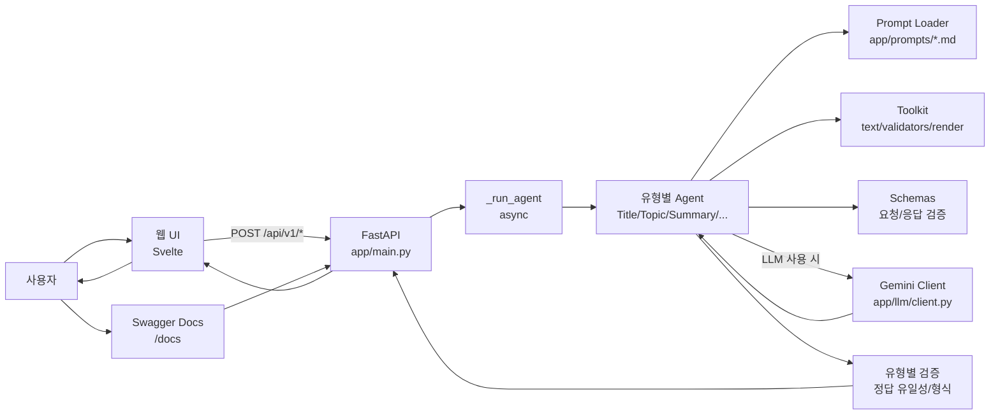
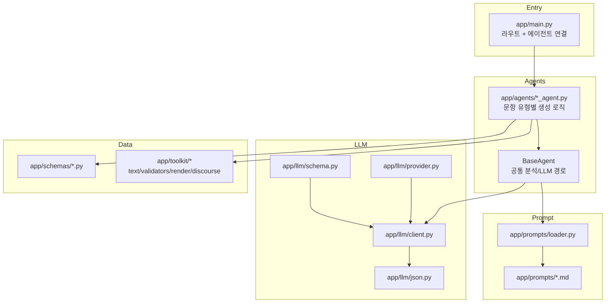

# Problem_Change_Project

영어 지문 1개를 입력하면, 한국 고교 모의고사 스타일의 객관식 문항을 자동으로 생성하는 서비스입니다.  
현재 총 11개 유형을 지원하며, FastAPI 백엔드 + Svelte 프론트엔드로 구성되어 있습니다.

## 서비스 개요

이 프로젝트는 단순 번역기가 아니라, 지문을 분석해 "시험 문제 형태"로 바꾸는 문제 생성 엔진입니다.

- 입력: 영어 지문 1개
- 출력: 문제 지시문, 선지 5개, 정답 1개, 해설
- 특징: 정답 유일성 검증, 유형별 생성 전략, 원문 보존 기반 표식 처리(빈칸/함축)

비전공자 기준으로 보면, 이 서비스는 "영어 지문을 넣으면 바로 문제지를 만들어주는 생성기"라고 이해하면 됩니다.

## 서비스 구조 (시각화)

### 1) 전체 요청 흐름



### 2) 백엔드 내부 구성



## 지원 문제 유형 (11개)

| 유형 | Endpoint | Agent | Prompt | Schema |
|---|---|---|---|---|
| 제목 | `POST /api/v1/title` | `TitleAgent` | `app/prompts/title.md` | `app/schemas/title.py` |
| 주제 | `POST /api/v1/topic` | `TopicAgent` | `app/prompts/topic.md` | `app/schemas/topic.py` |
| 요약 | `POST /api/v1/summary` | `SummaryAgent` | `app/prompts/summary.md` | `app/schemas/summary.py` |
| 함축의미 | `POST /api/v1/implicit` | `ImplicitAgent` | `app/prompts/implicit.md` | `app/schemas/implicit.py` |
| 문장삽입 | `POST /api/v1/insertion` | `InsertionAgent` | `app/prompts/insertion.md` | `app/schemas/insertion.py` |
| 글의 순서 | `POST /api/v1/order` | `OrderAgent` | `app/prompts/order.md` | `app/schemas/order.py` |
| 무관문장 | `POST /api/v1/irrelevant` | `IrrelevantAgent` | `app/prompts/irrelevant.md` | `app/schemas/irrelevant.py` |
| 빈칸 | `POST /api/v1/blank` | `BlankAgent` | `app/prompts/blank.md` | `app/schemas/blank.py` |
| 지칭 | `POST /api/v1/reference` | `ReferenceAgent` | `app/prompts/reference.md` | `app/schemas/reference.py` |
| 어휘 | `POST /api/v1/vocab` | `VocabAgent` | `app/prompts/vocab.md` | `app/schemas/vocab.py` |
| 어법 | `POST /api/v1/grammar` | `GrammarAgent` | `app/prompts/grammar.md` | `app/schemas/grammar.py` |

## 에이전트 구조 설명

각 문제 유형은 "전담 생성기(Agent)"가 따로 있습니다.  
예를 들어 요약 문제는 `SummaryAgent`가, 함축의미 문제는 `ImplicitAgent`가 담당합니다.

공통적으로 다음 흐름으로 동작합니다.

1. 지문 전처리 (길이, 형식 점검)
2. 지문 분석 (주제, 핵심 문장, 키워드 추출)
3. LLM 생성 시도 (프롬프트 + JSON 스키마)
4. 검증 (선지 5개, 정답 일치, 유형별 형식 검사)
5. 실패 시 fallback 로직으로 안전 생성

## 비동기 처리 구조

현재 API 라우트는 전부 `async`로 동작합니다.

- 라우트 함수: `async def`
- 공통 실행기: `app/main.py`의 `_run_agent(...)`
- Agent 실행: `BaseAgent.agenerate(...)`에서 `asyncio.to_thread(...)` 사용

즉, 내부 생성 로직이 동기 함수여도 이벤트 루프를 막지 않도록, 요청 처리 경계는 비동기 방식으로 구성되어 있습니다.

## 원문 보존 원칙

이 프로젝트는 "문제 생성 중 원문을 임의로 바꾸지 않는 것"을 중요하게 다룹니다.

- `blank`: 원문에서 정답 스팬만 `_____`로 치환
- `implicit`: 원문에서 타깃 스팬만 `[[1]]...[[/1]]` 표식 처리

이 방식 덕분에 원문 무결성을 검증할 수 있고, UI에서도 정확한 위치 표시가 가능합니다.

## 프로젝트 구조

```text
app/
  agents/        # 유형별 문제 생성기
  schemas/       # 요청/응답 데이터 구조
  prompts/       # LLM 지시문 템플릿
  toolkit/       # 검증, 텍스트 처리, 렌더링 유틸
  llm/           # LLM 클라이언트, JSON 파싱/스키마 처리
  main.py        # FastAPI 라우트 진입점
frontend/
  src/           # Svelte UI
tests/           # 스모크/유효성/무결성 테스트
```

## 환경 변수(.env) 설명

`app/core/config.py` 기준으로 아래 값을 사용합니다.

| 변수명 | 기본값 | 설명 |
|---|---|---|
| `APP_ENV` | `dev` | 실행 환경 (`dev`, `test` 등) |
| `LOG_LEVEL` | `INFO` | 로그 레벨 |
| `GOOGLE_API_KEY` | `""` | Gemini API 키 (권장) |
| `GEMINI_API_KEY` | `""` | 대체 API 키 |
| `GEMINI_MODEL` | `gemini-3-flash-preview` | 사용 모델 |
| `DEFAULT_TEMPERATURE` | `0.6` | 기본 생성 온도 |
| `DEFAULT_MAX_OUTPUT_TOKENS` | `20000` | 기본 최대 토큰 |
| `USE_LLM_GENERATION` | `true` | LLM 생성 사용 여부 |
| `ENABLE_SELF_CHECK` | `false` | 자체 점검 사용 여부 |
| `SELF_CHECK_MAX_RETRY` | `1` | 자체 점검 재시도 횟수 |

`GOOGLE_API_KEY` 또는 `GEMINI_API_KEY` 중 하나만 있어도 됩니다.

## 백엔드 실행

```bash
uv sync --group dev
uv run uvicorn app.main:app --reload --host 0.0.0.0 --port 8000
```

Swagger 문서:

- `http://localhost:8000/docs`

상태 확인:

- `GET /health`

## 프론트엔드 실행

```bash
cd frontend
npm install
npm run dev
```

기본적으로 Vite proxy는 `http://localhost:8000` 백엔드로 연결됩니다.

WSL + Windows 혼합 실행 시, `frontend/vite.config.js`가 Windows host IP를 자동 감지해 proxy target으로 사용합니다.

proxy를 강제로 지정하려면:

```bash
cd frontend
VITE_PROXY_TARGET=http://127.0.0.1:8000 npm run dev
```

프론트 빌드:

```bash
cd frontend
npm run build
```

## 테스트

전체 테스트:

```bash
uv run pytest
```

특정 테스트만:

```bash
uv run pytest tests/test_type_validators.py -q
```

## API 빠른 예시

요약 문제 생성 예시:

```bash
curl -X POST "http://localhost:8000/api/v1/summary" \
  -H "Content-Type: application/json" \
  -d '{
    "passage": "People often rely on routines because habits reduce cognitive load and free attention for difficult tasks. However, habits can hide weak assumptions when people stop reflecting on why they act in a certain way. Therefore, good decision making requires stable routines and periodic review. When individuals compare evidence and context, they can keep useful patterns while revising outdated ones.",
    "difficulty": "mid",
    "seed": 123,
    "explain": true,
    "return_korean_stem": true,
    "debug": false
  }'
```

## <가이드>

아래 순서대로 그대로 따라하면, 개발 서버에서 바로 사용 가능합니다.

### 1) 준비물 설치

- Python 3.10 이상
- Node.js 18 이상
- `uv` 설치

`uv` 설치 예시:

```bash
pip install uv
```

### 2) 프로젝트 폴더 이동

```bash
cd D:\English_Problem_Change\Problem_Change_Project
```

### 3) `.env` 파일 만들기

프로젝트 루트에 `.env` 파일을 만들고 아래처럼 입력합니다.

```env
APP_ENV=dev
LOG_LEVEL=INFO

GOOGLE_API_KEY=여기에_키_입력
# GEMINI_API_KEY=여기에_대체키_입력
GEMINI_MODEL=gemini-3-flash-preview

USE_LLM_GENERATION=true
ENABLE_SELF_CHECK=false
SELF_CHECK_MAX_RETRY=1
```

API 키 없이 로컬 fallback만 테스트하려면:

```env
USE_LLM_GENERATION=false
```

### 4) 백엔드 라이브러리 설치

```bash
uv sync --group dev
```

### 5) 백엔드 서버 실행

```bash
uv run uvicorn app.main:app --reload --host 0.0.0.0 --port 8000
```

성공하면 브라우저에서:

- `http://localhost:8000/docs` 접속

### 6) 프론트엔드 실행 (새 터미널)

```bash
cd D:\English_Problem_Change\Problem_Change_Project\frontend
npm install
npm run dev
```

프론트 주소(보통):

- `http://localhost:5173`

### 7) 실제 사용

- 프론트에서 유형 선택 (`title/topic/summary/implicit/...`)
- 지문 입력
- `문항 생성` 클릭
- 결과에서 정답/해설/JSON 확인

### 8) 빠른 점검 명령

백엔드 상태 확인:

```bash
curl http://localhost:8000/health
```

테스트 실행:

```bash
uv run pytest -q
```

프론트 빌드 확인:

```bash
cd frontend
npm run build
```
