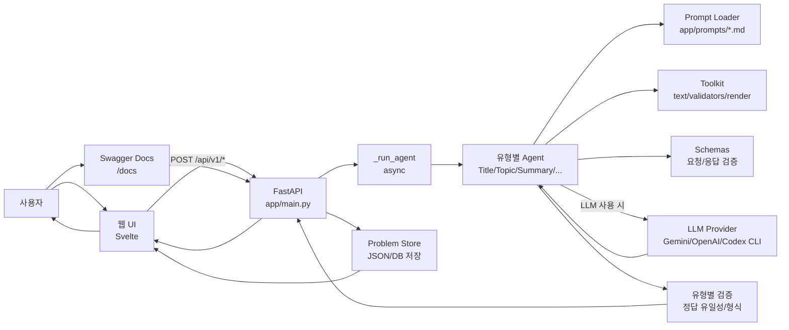
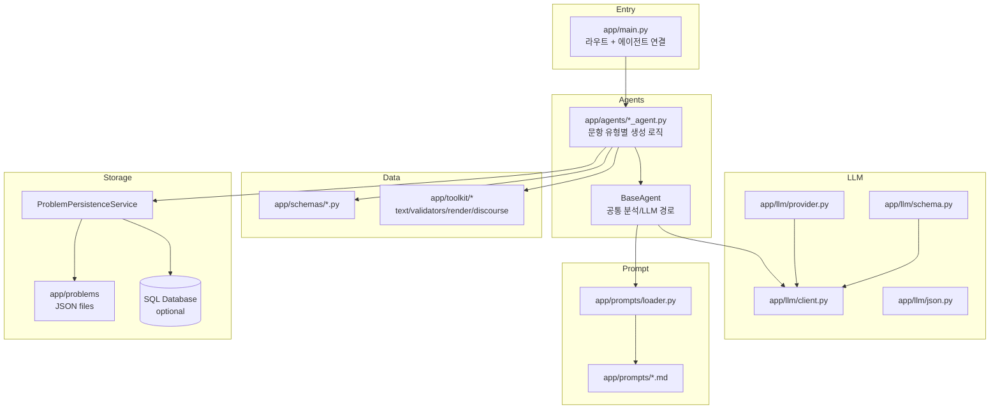
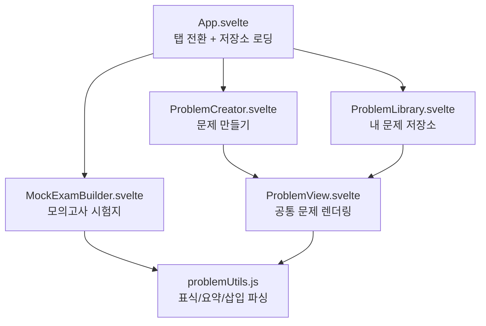

# Problem_Change_Project

영어 지문 1개를 입력하면, 한국 고교 모의고사 스타일의 객관식 문항을 자동으로 생성하는 서비스입니다.<br>
현재 총 11개 유형을 지원하며, FastAPI 백엔드 + Svelte 프론트엔드로 구성되어 있습니다.

이제 단순 문항 생성뿐 아니라, 생성한 문제를 개인 문제 저장소에 계속 보관하고, 저장된 문제들을 조합해 실제 모의고사 문제지와 해설지까지 만들 수 있습니다.

## 서비스 개요

이 프로젝트는 단순 번역기가 아니라, 지문을 분석해 "시험 문제 형태"로 바꾸는 문제 생성 엔진입니다.

- 입력: 영어 지문 1개
- 출력: 문제 지시문, 선지 5개, 정답 1개, 해설
- 저장: 생성한 문제를 개인 문제 저장소에 자동 보관
- 재사용: 저장된 문제를 모의고사 시험지와 해설지로 재구성
- 특징: 정답 유일성 검증, 유형별 생성 전략, 원문 보존 기반 표식 처리

비전공자 기준으로 보면, 이 서비스는 "영어 지문을 넣으면 변형문제를 만들고, 만든 문제를 모아 나만의 모의고사 문제집까지 구성하는 도구"라고 이해하면 됩니다.

## 핵심 기능

### 1. 문제 만들기

- 영어 지문 입력
- 11개 문제 유형 선택
- 난이도 선택
- 해설 포함 여부 선택
- 생성 결과 즉시 확인
- 생성된 문제 자동 저장

### 2. 내 문제 저장소

- 생성했던 변형문제를 최신순으로 조회
- 유형별 필터
- 질문/지문/해설 검색
- 문제 카드 클릭 시 모달로 크게 보기
- 개인 DB처럼 문제를 계속 누적 보관

### 3. 모의고사 시험지

- 저장소 문제만 사용해 시험지 구성
- 원하는 문항 수 입력
- 포함할 문제 유형 선택
- 한국 모의고사 스타일 2단 레이아웃
- 왼쪽 교체 후보 목록 제공
- 후보 문제 클릭 선택 후 특정 문항 교체
- 드래그앤드롭으로 원하는 문항에 문제 교체
- 정답표 표시 옵션
- 해설지 표시 옵션
- 브라우저 인쇄/PDF 저장

## 서비스 구조 (시각화)

### 1) 전체 요청 흐름


```mermaid
flowchart LR
    U[사용자] --> W[웹 UI<br/>Svelte]
    U --> D[Swagger Docs<br/>/docs]

    W -->|POST /api/v1/*| API[FastAPI<br/>app/main.py]
    D --> API

    API --> R[_run_agent<br/>async]
    R --> A[유형별 Agent<br/>Title/Topic/Summary/...]

    A --> P[Prompt Loader<br/>app/prompts/*.md]
    A --> T[Toolkit<br/>text/validators/render]
    A --> S[Schemas<br/>요청/응답 검증]

    A -->|LLM 사용 시| LLM[LLM Provider<br/>Gemini/OpenAI/Codex CLI]
    LLM --> A

    A --> V[유형별 검증<br/>정답 유일성/형식]
    V --> API
    API --> SAVE[Problem Store<br/>JSON/DB 저장]
    SAVE --> W
    API --> W
    W --> U
```

### 2) 백엔드 내부 구성


```mermaid
flowchart TB
    subgraph Entry
      M[app/main.py<br/>라우트 + 에이전트 연결]
    end

    subgraph Agents
      AG[app/agents/*_agent.py<br/>문항 유형별 생성 로직]
      BA[BaseAgent<br/>공통 분석/LLM 경로]
    end

    subgraph LLM
      LC[app/llm/client.py]
      LP[app/llm/provider.py]
      LJ[app/llm/json.py]
      LS[app/llm/schema.py]
    end

    subgraph Prompt
      PR[app/prompts/*.md]
      PL[app/prompts/loader.py]
    end

    subgraph Data
      SC[app/schemas/*.py]
      TK[app/toolkit/*<br/>text/validators/render/discourse]
    end

    subgraph Storage
      PS[ProblemPersistenceService]
      FS[app/problems<br/>JSON files]
      DB[(SQL Database<br/>optional)]
    end

    M --> AG
    AG --> BA
    BA --> PL --> PR
    BA --> LC
    LP --> LC
    LS --> LC
    AG --> SC
    AG --> TK
    AG --> PS
    PS --> FS
    PS --> DB
```

### 3) 프론트엔드 구성


```mermaid
flowchart TB
    APP[App.svelte<br/>탭 전환 + 저장소 로딩]

    APP --> C[ProblemCreator.svelte<br/>문제 만들기]
    APP --> L[ProblemLibrary.svelte<br/>내 문제 저장소]
    APP --> E[MockExamBuilder.svelte<br/>모의고사 시험지]

    C --> PV[ProblemView.svelte<br/>공통 문제 렌더링]
    L --> PV
    E --> U[problemUtils.js<br/>표식/요약/삽입 파싱]
    PV --> U
```

## 지원 문제 유형 (11개)

| 유형 | Endpoint | Agent | Prompt | Schema |
|---|---|---|---|---|
| 제목 | `POST /api/v1/title` | `TitleAgent` | `app/prompts/title.md` | `app/schemas/title.py` |
| 주제 | `POST /api/v1/topic` | `TopicAgent` | `app/prompts/topic.md` | `app/schemas/topic.py` |
| 요약 | `POST /api/v1/summary` | `SummaryAgent` | `app/prompts/summary.md` | `app/schemas/summary.py` |
| 함축의미 | `POST /api/v1/implicit` | `ImplicitAgent` | `app/prompts/implicit.md` | `app/schemas/implicit.py` |
| 문장삽입 | `POST /api/v1/insertion` | `InsertionAgent` | `app/prompts/insertion.md` | `app/schemas/insertion.py` |
| 글의 순서 | `POST /api/v1/order` | `OrderAgent` | `app/prompts/order.md` | `app/schemas/order.py` |
| 무관문장 | `POST /api/v1/irrelevant` | `IrrelevantAgent` | `app/prompts/irrelevant.md` | `app/schemas/irrelevant.py` |
| 빈칸 | `POST /api/v1/blank` | `BlankAgent` | `app/prompts/blank.md` | `app/schemas/blank.py` |
| 지칭 | `POST /api/v1/reference` | `ReferenceAgent` | `app/prompts/reference.md` | `app/schemas/reference.py` |
| 어휘 | `POST /api/v1/vocab` | `VocabAgent` | `app/prompts/vocab.md` | `app/schemas/vocab.py` |
| 어법 | `POST /api/v1/grammar` | `GrammarAgent` | `app/prompts/grammar.md` | `app/schemas/grammar.py` |

## 저장소 API

| 기능 | Endpoint | 설명 |
|---|---|---|
| 저장 문제 목록 | `GET /api/v1/problems` | 저장된 변형문제를 최신순으로 조회 |
| 저장 문제 상세 | `GET /api/v1/problems/{problem_uid}` | 고유 ID로 저장 문제 1개 조회 |

쿼리 예시:

```text
GET /api/v1/problems?limit=100
GET /api/v1/problems?problem_type=blank&limit=50
```

## 에이전트 구조 설명

각 문제 유형은 "전담 생성기(Agent)"가 따로 있습니다.<br>
예를 들어 요약 문제는 `SummaryAgent`가, 함축의미 문제는 `ImplicitAgent`가 담당합니다.

공통적으로 다음 흐름으로 동작합니다.

1. 지문 전처리
2. 지문 분석
3. LLM 생성 시도
4. 유형별 검증
5. 실패 시 fallback 로직으로 안전 생성
6. 생성 결과 저장

## LLM Provider 구조

현재는 `LLM_PROVIDER` 환경 변수로 생성 provider를 바꿀 수 있습니다.

| Provider | 설정값 | 필요 조건 | 비고 |
|---|---|---|---|
| Gemini | `gemini` | `GOOGLE_API_KEY` 또는 `GEMINI_API_KEY` | 기본 provider |
| OpenAI API | `openai` | `OPENAI_API_KEY` | 운영 사용에 적합 |
| Codex CLI | `codex_cli` | 로컬 Codex CLI 로그인 | 로컬 실험용 |

Codex CLI provider는 현재 로그인된 로컬 Codex CLI 세션을 subprocess로 호출합니다. 토큰 파일을 직접 꺼내 API 키처럼 쓰는 방식이 아닙니다. 요청마다 CLI 프로세스를 실행하므로 실제 운영 환경에서는 `openai` 또는 `gemini` provider를 권장합니다.

## 비동기 처리 구조

현재 API 라우트는 전부 `async`로 동작합니다.

- 라우트 함수: `async def`
- 공통 실행기: `app/main.py`의 `_run_agent(...)`
- Agent 실행: `BaseAgent.agenerate(...)`에서 thread executor 사용

즉, 내부 생성 로직이 동기 함수여도 이벤트 루프를 막지 않도록 요청 처리 경계는 비동기 방식으로 구성되어 있습니다.

## 원문 보존 원칙

이 프로젝트는 "문제 생성 중 원문을 임의로 바꾸지 않는 것"을 중요하게 다룹니다.

- `blank`: 원문에서 정답 스팬만 `_____`로 치환
- `implicit`: 원문에서 타깃 스팬만 `[[1]]...[[/1]]` 표식 처리
- `vocab`, `grammar`, `reference`: 원문 내 표식 기반으로 선택 위치 표시
- 프론트엔드는 표식을 파싱해 밑줄/번호 형태로 렌더링

이 방식 덕분에 원문 무결성을 검증할 수 있고, UI에서도 정확한 위치 표시가 가능합니다.

## 프로젝트 구조

```text
app/
  agents/        # 유형별 문제 생성기
  schemas/       # 요청/응답 + 저장 스키마
  prompts/       # LLM 지시문 템플릿
  toolkit/       # 검증, 텍스트 처리, 렌더링 유틸
  llm/           # Gemini/OpenAI/Codex CLI, JSON 파싱/스키마 처리
  storage/       # 파일/DB 저장 서비스
  db/            # SQLAlchemy DB 모델
  problems/      # 저장된 문제 JSON + JSON Schema
  main.py        # FastAPI 라우트 진입점

frontend/
  src/
    App.svelte
    components/
      ProblemCreator.svelte
      ProblemLibrary.svelte
      MockExamBuilder.svelte
      ProblemView.svelte
    lib/
      problemUtils.js
    app.css

tests/           # 스모크/유효성/무결성/저장소 테스트
Dockerfile
docker-compose.yml
Makefile
AGENTS.md
```

## 문제 저장 구조 (JSON + DB)

문항이 생성되면 기본값 `ENABLE_PROBLEM_PERSISTENCE=true`에 따라 자동으로 JSON 파일이 저장됩니다.

- 파일 경로 규칙: `app/problems/{problem_type}/{passage_id}/attempt_{n}.json`
- `passage_id`: 지문 정규화 후 SHA-256 해시 앞 16자리
- `attempt_no`: 같은 `problem_type + passage_id` 조합에서 1부터 순번 증가
- 저장 스키마 파일: `app/problems/problem_record.schema.json`

저장된 JSON에는 `request`, `result`, `storage_meta`가 함께 들어가며, API 응답의 `meta.storage`에도 아래 정보가 포함됩니다.

- `problem_uid`
- `passage_id`
- `attempt_no`
- `file_path`
- `db_saved`
- `db_row_id`

`ENABLE_DB_PERSISTENCE=true`이고 `DATABASE_URL`이 설정되면 SQLAlchemy로 `problem_records` 테이블에도 함께 저장됩니다.

## 프론트엔드 화면 사용법

### 1) 문제 만들기

1. `문제 만들기` 탭으로 이동합니다.
2. 문제 유형을 선택합니다.
3. 난이도를 선택합니다.
4. 영어 지문을 입력합니다.
5. `문항 생성`을 누릅니다.
6. 결과가 생성되면 저장소에 자동으로 보관됩니다.

### 2) 내 문제 저장소

1. `내 문제 저장소` 탭으로 이동합니다.
2. 유형 필터 또는 검색어로 문제를 찾습니다.
3. 문제 카드를 클릭하면 모달로 크게 볼 수 있습니다.

### 3) 모의고사 시험지

1. `모의고사 시험지` 탭으로 이동합니다.
2. 시험지 제목과 문항 수를 입력합니다.
3. 포함할 문제 유형을 선택합니다.
4. `시험지 만들기`를 누릅니다.
5. 왼쪽 `교체 후보 문제`에서 후보를 클릭하거나 드래그해 원하는 문항에 넣습니다.
6. 필요하면 `정답표 표시`, `해설지 표시`를 켭니다.
7. `인쇄 / PDF 저장`으로 출력합니다.

## 환경 변수(.env) 설명

`app/core/config.py` 기준으로 아래 값을 사용합니다.

| 변수명 | 기본값 | 설명 |
|---|---|---|
| `APP_ENV` | `dev` | 실행 환경 (`dev`, `test` 등) |
| `LOG_LEVEL` | `INFO` | 로그 레벨 |
| `LLM_PROVIDER` | `gemini` | LLM 제공자 (`gemini`, `openai`, `codex_cli`) |
| `GOOGLE_API_KEY` | `""` | Gemini API 키 |
| `GEMINI_API_KEY` | `""` | Gemini 대체 API 키 |
| `GEMINI_MODEL` | `gemini-3-flash-preview` | Gemini 모델 |
| `OPENAI_API_KEY` | `""` | OpenAI API 키 |
| `OPENAI_MODEL` | `gpt-5-mini` | OpenAI 모델 |
| `OPENAI_BASE_URL` | `https://api.openai.com/v1` | OpenAI 호환 API base URL |
| `OPENAI_REASONING_EFFORT` | `""` | reasoning effort 옵션 |
| `OPENAI_TIMEOUT_SECONDS` | `120` | OpenAI 요청 타임아웃 |
| `CODEX_CLI_COMMAND` | `codex` | Codex CLI 명령어 |
| `CODEX_CLI_MODEL` | `""` | Codex CLI 모델명, 비우면 CLI 기본값 |
| `CODEX_CLI_TIMEOUT_SECONDS` | `300` | Codex CLI 요청 타임아웃 |
| `DEFAULT_TEMPERATURE` | `0.6` | 기본 생성 온도 |
| `DEFAULT_MAX_OUTPUT_TOKENS` | `20000` | 기본 최대 토큰 |
| `USE_LLM_GENERATION` | `true` | LLM 생성 사용 여부 |
| `ENABLE_SELF_CHECK` | `false` | 자체 점검 사용 여부 |
| `SELF_CHECK_MAX_RETRY` | `1` | 자체 점검 재시도 횟수 |
| `ENABLE_PROBLEM_PERSISTENCE` | `true` | 생성 결과를 `app/problems`에 JSON 파일로 저장할지 여부 |
| `ENABLE_DB_PERSISTENCE` | `false` | SQLAlchemy를 통해 DB에도 함께 저장할지 여부 |
| `DATABASE_URL` | `""` | DB 연결 문자열 |
| `DATABASE_ECHO` | `false` | SQLAlchemy SQL 로그 출력 여부 |

## `.env` 예시

### Gemini 사용

```env
APP_ENV=dev
LOG_LEVEL=INFO

LLM_PROVIDER=gemini
GOOGLE_API_KEY=여기에_Gemini_API_키_입력
GEMINI_MODEL=gemini-3-flash-preview

USE_LLM_GENERATION=true
ENABLE_SELF_CHECK=false
SELF_CHECK_MAX_RETRY=1

ENABLE_PROBLEM_PERSISTENCE=true
ENABLE_DB_PERSISTENCE=false
DATABASE_ECHO=false
```

### OpenAI API 사용

```env
APP_ENV=dev
LOG_LEVEL=INFO

LLM_PROVIDER=openai
OPENAI_API_KEY=여기에_OpenAI_API_키_입력
OPENAI_MODEL=gpt-5-mini

USE_LLM_GENERATION=true
ENABLE_SELF_CHECK=false
SELF_CHECK_MAX_RETRY=1

ENABLE_PROBLEM_PERSISTENCE=true
ENABLE_DB_PERSISTENCE=false
DATABASE_ECHO=false
```

### Codex CLI 사용

```env
APP_ENV=dev
LOG_LEVEL=INFO

LLM_PROVIDER=codex_cli
CODEX_CLI_COMMAND=codex
CODEX_CLI_MODEL=

USE_LLM_GENERATION=true
ENABLE_SELF_CHECK=false
SELF_CHECK_MAX_RETRY=1

ENABLE_PROBLEM_PERSISTENCE=true
ENABLE_DB_PERSISTENCE=false
DATABASE_ECHO=false
```

## 백엔드 실행

```bash
uv sync --group dev
uv run uvicorn app.main:app --reload --host 0.0.0.0 --port 8000
```

Swagger 문서:

- `http://localhost:8000/docs`

상태 확인:

- `GET /health`

## Makefile 명령

```bash
make start      # 백엔드(uvicorn) 포그라운드 실행
make stop       # 백엔드(uvicorn) 종료
make frontend   # 프론트엔드(vite) 실행
make up         # docker compose up --build -d
make down       # docker compose down
```

`make start`는 로그를 현재 터미널에 바로 출력합니다. 종료는 `Ctrl+C` 또는 다른 터미널에서 `make stop`으로 가능합니다.

## Docker Compose 실행 (API 8000 + PostgreSQL)

```bash
make up
```

- API: `http://localhost:8000`
- Swagger: `http://localhost:8000/docs`
- PostgreSQL: `localhost:5432`

문제 JSON은 로컬 `app/problems` 디렉터리로 볼륨 마운트되어 컨테이너 재시작 후에도 유지됩니다.

종료:

```bash
make down
```

## 프론트엔드 실행

```bash
make frontend
```

기본적으로 Vite proxy는 `http://localhost:8000` 백엔드로 연결됩니다.

WSL + Windows 혼합 실행 시, `frontend/vite.config.js`가 Windows host IP를 자동 감지해 proxy target으로 사용합니다.

proxy를 강제로 지정하려면:

```bash
cd frontend
VITE_PROXY_TARGET=http://127.0.0.1:8000 npm run dev
```

프론트 빌드:

```bash
cd frontend
npm run build
```

## 테스트

전체 테스트:

```bash
uv run pytest
```

특정 테스트만:

```bash
uv run pytest tests/test_type_validators.py -q
```

프론트 빌드:

```bash
cd frontend
npm run build
```

## API 빠른 예시

요약 문제 생성 예시:

```bash
curl -X POST "http://localhost:8000/api/v1/summary" \
  -H "Content-Type: application/json" \
  -d '{
    "passage": "People often rely on routines because habits reduce cognitive load and free attention for difficult tasks. However, habits can hide weak assumptions when people stop reflecting on why they act in a certain way. Therefore, good decision making requires stable routines and periodic review. When individuals compare evidence and context, they can keep useful patterns while revising outdated ones.",
    "difficulty": "mid",
    "seed": 123,
    "explain": true,
    "return_korean_stem": true,
    "debug": false
  }'
```

저장된 문제 목록 조회:

```bash
curl "http://localhost:8000/api/v1/problems?limit=50"
```

특정 유형만 조회:

```bash
curl "http://localhost:8000/api/v1/problems?problem_type=blank&limit=50"
```

## <가이드>

아래 순서대로 진행하면 개발/도커 실행을 바로 할 수 있습니다.

### 1) 준비물

- Python 3.10+
- Node.js 18+
- `uv`
- Docker Desktop (Docker 사용 시)

WSL에서 `make`가 없다면:

```bash
sudo apt update
sudo apt install -y make
```

### 2) 프로젝트 이동

```bash
cd /mnt/d/English_Problem_Change/Problem_Change_Project
```

### 3) 의존성 설치

```bash
uv sync --group dev
cd frontend && npm install
```

### 4) 로컬 실행 (권장)

백엔드:

```bash
make start
```

프론트엔드(새 터미널):

```bash
make frontend
```

### 5) Docker 실행

```bash
make up
```

종료:

```bash
make down
```

### 6) 저장 결과 확인

문항 생성 후 아래 경로에 JSON이 생깁니다.

```text
app/problems/{problem_type}/{passage_id}/attempt_{n}.json
```

### 7) 문제 해결 팁 (WSL + Docker)

`permission denied ... /var/run/docker.sock`가 나오면:

```bash
sudo groupadd docker 2>/dev/null || true
sudo usermod -aG docker $USER
newgrp docker
```

Git Bash에서 `git`, `sed`를 찾지 못하면 Git Bash의 `PATH`가 깨진 상태일 수 있습니다. 임시로 아래를 실행할 수 있습니다.

```bash
export PATH="/mingw64/bin:/usr/bin:/bin:/c/Windows/System32:/c/Windows:$PATH"
```

## 개발자 문서

개발 에이전트와 유지보수자는 `AGENTS.md`를 우선 확인하세요.

- `AGENTS.md`: 현재 코드 기준 통합 개발 가이드
- `codex.md`: 초기 설계 문서
- `codex_update.md`: topic/implicit 추가 설계 문서

앞으로 기능이 바뀌면 `AGENTS.md`와 `README.md`를 함께 갱신하는 것을 권장합니다.
