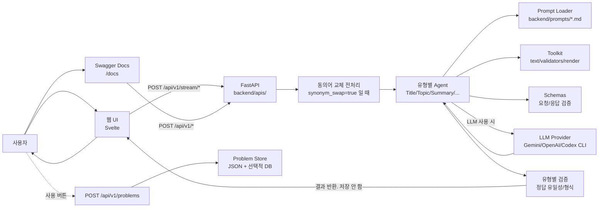
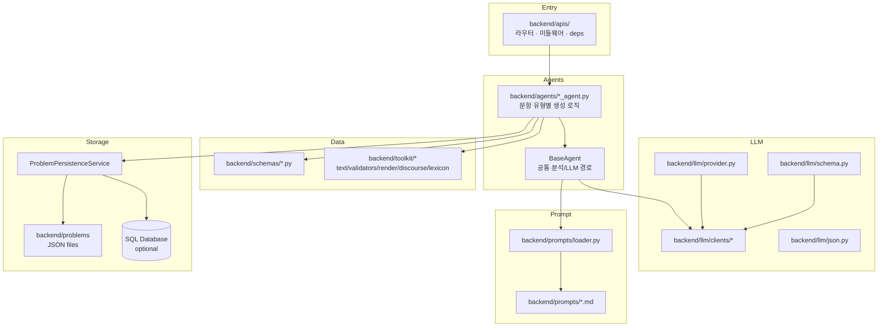
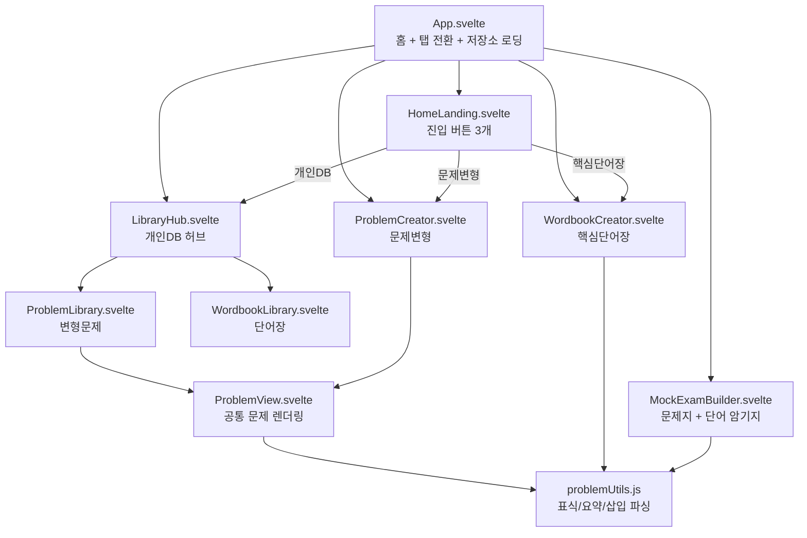

# Problem_Change_Project

영어 지문 1개를 입력하면, 한국 고교 모의고사 스타일의 객관식 문항을 자동으로 생성하는 서비스입니다.<br>
현재 총 11개 유형을 지원하며, FastAPI 백엔드 + Svelte 프론트엔드로 구성되어 있습니다.

이제 단순 문항 생성뿐 아니라, 생성한 문제를 개인 문제 저장소에 계속 보관하고, 저장된 문제들을 조합해 실제 모의고사 문제지와 해설지까지 만들 수 있습니다.

## 서비스 개요

이 프로젝트는 단순 번역기가 아니라, 지문을 분석해 "시험 문제 형태"로 바꾸는 문제 생성 엔진입니다.

- 입력: 영어 지문 1개
- 출력: 문제 지시문, 선지 5개, 정답 1개, 해설
- 저장: 결과를 확인하고 **"사용"을 눌렀을 때만** 개인 저장소에 보관 (자동 저장 아님)
- 재사용: 저장된 문제를 모의고사 시험지와 해설지로 재구성
- 특징: 정답 유일성 검증, 유형별 생성 전략, 원문 보존 기반 표식 처리

비전공자 기준으로 보면, 이 서비스는 "영어 지문을 넣으면 변형문제를 만들고, 만든 문제를 모아 나만의 모의고사 문제집까지 구성하는 도구"라고 이해하면 됩니다.

## 핵심 기능

### 0. 홈 화면

첫 진입 시 화면 가운데에서 세 가지 중 하나를 고릅니다.

| 버튼 | 이동하는 곳 |
|---|---|
| 문제변형 | 지문으로 변형문항을 만드는 화면 |
| 핵심단어장 | 지문의 핵심단어를 정리하는 화면 |
| 개인DB | 내가 만든 문제가 쌓이는 보관함(여기서 모의고사 제작) |

홈을 벗어나면 상단 탭으로 네 화면(문제변형 / 핵심단어장 / 개인DB / 모의고사 출제)과 홈을 자유롭게 오갈 수 있습니다.

### 1. 문제변형

- 영어 지문 입력
- 11개 문제 유형 선택
- 난이도 선택 — easy/mid/hard 가 실제로 다른 문항을 만듭니다
  (정답의 추상화 정도, 오답이 틀리는 지점, 근거 문장 수, 선지 어휘 수준이 단계별로 달라집니다)
- 해설 포함 여부 선택
- 생성 중 진행 상황을 실시간으로 표시(스트리밍)
- 결과를 확인하고 **"사용"을 눌러야** 개인DB에 저장

생성만 하고 마음에 안 들면 그냥 버리면 됩니다. 저장은 "사용"을 눌렀을 때만 일어납니다.

#### 지문 단어 동의어로 바꾸기

학생들이 기출 지문을 통째로 외워 오는 것을 막는 기능입니다.
지문의 단어 몇 개를 같은 뜻의 다른 단어로 바꿔서, 익숙한 지문을 낯설게 만듭니다.

- 난이도에 따라 **문장당 0.7 / 1 / 1.5개** 교체 (easy / mid / hard)
- 연결어(`however`, `therefore`, `for example`), 고유명사, 숫자는 **건드리지 않습니다**
- 바뀐 단어 목록이 결과 위에 표시되고, **체크를 해제하면 원래 단어로 되돌릴 수 있습니다**
- "사용"을 누르면 화면에 보이는 그대로 저장됩니다

적용 가능한 유형은 **제목·주제·요약·빈칸·함축** 5개입니다.
어휘·어법은 정답이 둘이 될 수 있고, 삽입·순서·무관문장은 연결어 단서가 흔들려 제외했습니다.
(지원하지 않는 유형을 고르면 체크박스가 자동으로 비활성화됩니다.)

### 2. 핵심단어장

지문을 넣으면 그 지문을 공부하는 데 필요한 단어를 **빠짐없이** 뽑아 정리합니다.

- 단어마다: 표제어, 지문에 나온 형태, 핵심/보조 구분, CEFR 난이도, 지문에서의 뜻, 지문 예문
- 뜻마다: 품사, 한국어 뜻, 영어 정의, **그 뜻에 맞는** 동의어·반의어 (한국어 뜻과 품사 포함)
- 한 단어가 명사와 동사로 모두 쓰이면 품사별로 뜻을 따로 제공합니다
- 동의어는 **난이도를 가리지 않고** 쉬운 것부터 학술어까지 한 목록에 담습니다
  (예: `reduce` → `decrease`, `diminish`, `curtail`)
- 단어/뜻/동의어 검색, 핵심어만 보기 필터
- 숙어 포함 여부, 뜻당 동의어·반의어 개수(1~8) 조절

10줄 지문에서 단어 1~2개만 나오는 일이 없도록, 서버가 지문에서 후보 단어를 먼저 뽑아
LLM 결과와 대조하고 빠진 단어는 보강 요청을 한 번 더 보냅니다.
그래도 정리되지 않은 단어가 있으면 화면에 그대로 표시합니다.

생성 중에는 1차 정리 결과가 먼저 화면에 뜨고, 보강이 끝나면 최종 결과로 바뀝니다.
마찬가지로 **"사용"을 눌러야** 개인DB에 저장됩니다. 저장할 때 제목을 지정할 수 있습니다.

### 3. 개인DB

"사용"을 누른 자료가 쌓이는 곳입니다. 홈 화면처럼 두 갈래로 나뉩니다.

| 구분 | 내용 |
|---|---|
| 변형문제 | 저장한 문항. 유형 필터, 검색, 카드 클릭 시 모달로 크게 보기 |
| 단어장 | 저장한 단어장. 지문 제목만 보이게 접혀 있고, 누르면 정리된 단어가 펼쳐짐 |

단어장은 하나에 수십 단어가 들어가므로 기본적으로 접혀 있습니다.
`모두 펼치기` / `모두 접기`로 한 번에 조절할 수 있고, 필요 없는 단어장은 삭제할 수 있습니다.

### 4. 모의고사 출제

두 가지를 만들 수 있습니다.

**문제 출제** — 저장한 변형문제로 시험지

- 원하는 문항 수 입력, 포함할 문제 유형 선택
- 한국 모의고사 스타일 2단 레이아웃
- 왼쪽 교체 후보 목록에서 클릭 또는 드래그앤드롭으로 특정 문항 교체
- 정답표 / 해설지 표시 옵션
- 브라우저 인쇄/PDF 저장

**단어 암기** — 저장한 단어장으로 학생 배포용 인쇄물

- 여러 단어장을 골라 합칠 수 있음(같은 단어는 자동으로 한 번만)
- 두 가지 형식:
  - `암기장` — 단어와 뜻이 모두 보이는 학습용
  - `시험지` — 뜻이 빈칸인 시험용 (정답지가 별지로 함께 출력)
- 1~3단 조절, 동의어·반의어 표시 여부, 핵심어만 보기
- 브라우저 인쇄/PDF 저장

## 서비스 구조 (시각화)

### 1) 전체 요청 흐름

생성과 저장은 **완전히 분리된 두 요청**입니다.


```mermaid
flowchart LR
    U[사용자] --> W[웹 UI<br/>Svelte]
    U --> D[Swagger Docs<br/>/docs]

    W -->|POST /api/v1/stream/*| API[FastAPI<br/>backend/apis/]
    D -->|POST /api/v1/*| API

    API --> SW[동의어 교체 전처리<br/>synonym_swap=true 일 때]
    SW --> A[유형별 Agent<br/>Title/Topic/Summary/...]

    A --> P[Prompt Loader<br/>backend/prompts/*.md]
    A --> T[Toolkit<br/>text/validators/render]
    A --> S[Schemas<br/>요청/응답 검증]

    A -->|LLM 사용 시| LLM[LLM Provider<br/>Gemini/OpenAI/Codex CLI]
    LLM --> A

    A --> V[유형별 검증<br/>정답 유일성/형식]
    V -->|결과 반환. 저장 안 함| W
    W --> U

    U -.->|"사용" 버튼| SAVE_REQ[POST /api/v1/problems]
    SAVE_REQ --> SAVE[Problem Store<br/>JSON + 선택적 DB]
```

### 2) 백엔드 내부 구성


```mermaid
flowchart TB
    subgraph Entry
      M[backend/apis/<br/>라우터 · 미들웨어 · deps]
    end

    subgraph Agents
      AG[backend/agents/*_agent.py<br/>문항 유형별 생성 로직]
      BA[BaseAgent<br/>공통 분석/LLM 경로]
    end

    subgraph LLM
      LC[backend/llm/clients/*]
      LP[backend/llm/provider.py]
      LJ[backend/llm/json.py]
      LS[backend/llm/schema.py]
    end

    subgraph Prompt
      PR[backend/prompts/*.md]
      PL[backend/prompts/loader.py]
    end

    subgraph Data
      SC[backend/schemas/*.py]
      TK[backend/toolkit/*<br/>text/validators/render/discourse/lexicon]
    end

    subgraph Storage
      PS[ProblemPersistenceService]
      FS[backend/problems<br/>JSON files]
      DB[(SQL Database<br/>optional)]
    end

    M --> AG
    AG --> BA
    BA --> PL --> PR
    BA --> LC
    LP --> LC
    LS --> LC
    AG --> SC
    AG --> TK
    AG --> PS
    PS --> FS
    PS --> DB
```

### 3) 프론트엔드 구성


```mermaid
flowchart TB
    APP[App.svelte<br/>홈 + 탭 전환 + 저장소 로딩]

    APP --> H[HomeLanding.svelte<br/>진입 버튼 3개]
    H -->|문제변형| C
    H -->|핵심단어장| WB
    H -->|개인DB| L

    APP --> C[ProblemCreator.svelte<br/>문제변형]
    APP --> WB[WordbookCreator.svelte<br/>핵심단어장]
    APP --> L[LibraryHub.svelte<br/>개인DB 허브]
    L --> PL[ProblemLibrary.svelte<br/>변형문제]
    L --> WL[WordbookLibrary.svelte<br/>단어장]
    APP --> E[MockExamBuilder.svelte<br/>문제지 + 단어 암기지]

    C --> PV[ProblemView.svelte<br/>공통 문제 렌더링]
    PL --> PV
    E --> U[problemUtils.js<br/>표식/요약/삽입 파싱]
    WB --> U
    PV --> U
```

## 지원 문제 유형 (11개)

| 유형 | Endpoint | Agent | Prompt | Schema |
|---|---|---|---|---|
| 제목 | `POST /api/v1/title` | `TitleAgent` | `backend/prompts/title.md` | `backend/schemas/title.py` |
| 주제 | `POST /api/v1/topic` | `TopicAgent` | `backend/prompts/topic.md` | `backend/schemas/topic.py` |
| 요약 | `POST /api/v1/summary` | `SummaryAgent` | `backend/prompts/summary.md` | `backend/schemas/summary.py` |
| 함축의미 | `POST /api/v1/implicit` | `ImplicitAgent` | `backend/prompts/implicit.md` | `backend/schemas/implicit.py` |
| 문장삽입 | `POST /api/v1/insertion` | `InsertionAgent` | `backend/prompts/insertion.md` | `backend/schemas/insertion.py` |
| 글의 순서 | `POST /api/v1/order` | `OrderAgent` | `backend/prompts/order.md` | `backend/schemas/order.py` |
| 무관문장 | `POST /api/v1/irrelevant` | `IrrelevantAgent` | `backend/prompts/irrelevant.md` | `backend/schemas/irrelevant.py` |
| 빈칸 | `POST /api/v1/blank` | `BlankAgent` | `backend/prompts/blank.md` | `backend/schemas/blank.py` |
| 지칭 | `POST /api/v1/reference` | `ReferenceAgent` | `backend/prompts/reference.md` | `backend/schemas/reference.py` |
| 어휘 | `POST /api/v1/vocab` | `VocabAgent` | `backend/prompts/vocab.md` | `backend/schemas/vocab.py` |
| 어법 | `POST /api/v1/grammar` | `GrammarAgent` | `backend/prompts/grammar.md` | `backend/schemas/grammar.py` |

## 어휘 학습 API

문항이 아니므로 위 11개 유형과 요청/응답 형식이 다르고, 문제 저장소에 저장되지 않습니다.

| 기능 | Endpoint | Agent | Prompt | Schema |
|---|---|---|---|---|
| 핵심단어장 | `POST /api/v1/wordbook` | `WordbookAgent` | `backend/prompts/wordbook.md` | `backend/schemas/wordbook.py` |

요청 필드:

| 필드 | 기본값 | 설명 |
|---|---|---|
| `passage` | (필수) | 영어 지문 원문 |
| `include_phrases` | `true` | 숙어·연어를 항목에 포함할지 |
| `max_related` | `4` | 한 뜻당 동의어/반의어 **최대** 개수(1~8). 실제 개수는 진짜 동의어가 있는 만큼만 나옵니다 |

응답 `meta` 필드:

| 필드 | 설명 |
|---|---|
| `candidate_count` | 서버가 지문에서 뽑은 핵심단어 후보 수 |
| `entry_count` | 실제로 정리된 단어 수 |
| `uncovered_candidates` | 보강 요청 후에도 정리되지 않은 단어 목록 |
| `generation_mode` | `llm` 또는 `local_fallback` |
| `notice` | LLM 비활성 등으로 결과가 불완전할 때의 안내 |

## 스트리밍 API

생성이 40~70초 걸리므로 진행 상황을 SSE로 흘려보냅니다. 프론트는 이 경로를 사용합니다.

| 기능 | Endpoint |
|---|---|
| 문항 생성(스트리밍) | `POST /api/v1/stream/{problem_type}` |
| 단어장 생성(스트리밍) | `POST /api/v1/stream-wordbook` |

이벤트 종류:

| 이벤트 | 내용 |
|---|---|
| `status` | 진행 단계 (`start` / `analyze` / `candidates` / `generating` / `expanding` / `validating`) |
| `partial` | 중간 결과. 단어장 1차 정리 결과가 여기로 옵니다 |
| `done` | 최종 결과(비스트리밍 엔드포인트와 같은 형식) |
| `error` | 실패. `detail`과 `status` 포함 |

LLM 응답 자체를 토큰 단위로 흘리지는 않습니다. 구조화된 JSON을 스키마로 받기 때문에
부분 JSON은 파싱할 수 없습니다. 대신 단계별 진행과 1차 결과를 먼저 보냅니다.

실측(단어장, 후보 37개): 0초에 후보 수 표시 → 35초에 1차 27단어 표시 → 49초에 최종 완료.

## 저장소 API

**생성과 저장은 분리되어 있습니다.** 생성 엔드포인트는 저장하지 않고,
화면에서 "사용"을 눌렀을 때 아래 저장 엔드포인트가 호출됩니다.

| 기능 | Endpoint | 설명 |
|---|---|---|
| 문항 저장("사용") | `POST /api/v1/problems` | `{request, result}`를 받아 개인DB에 보관 |
| 저장 문제 목록 | `GET /api/v1/problems` | 저장된 변형문제를 최신순으로 조회 |
| 저장 문제 상세 | `GET /api/v1/problems/{problem_uid}` | 고유 ID로 저장 문제 1개 조회 |
| 단어장 저장("사용") | `POST /api/v1/wordbooks` | `{title, request, result}`를 받아 개인DB에 보관 |
| 저장 단어장 목록 | `GET /api/v1/wordbooks` | 저장된 단어장을 최신순으로 조회 |
| 저장 단어장 상세 | `GET /api/v1/wordbooks/{wordbook_uid}` | 고유 ID로 단어장 1개 조회 |
| 저장 단어장 삭제 | `DELETE /api/v1/wordbooks/{wordbook_uid}` | 단어장 1개 삭제 |

문항은 `backend/problems`, 단어장은 `backend/wordbooks`에 저장됩니다.
단어장은 파일에만 저장되며 DB 테이블은 없습니다.

쿼리 예시:

```text
GET /api/v1/problems?limit=100
GET /api/v1/problems?problem_type=blank&limit=50
```

## 에이전트 구조 설명

각 문제 유형은 "전담 생성기(Agent)"가 따로 있습니다.<br>
예를 들어 요약 문제는 `SummaryAgent`가, 함축의미 문제는 `ImplicitAgent`가 담당합니다.

공통적으로 다음 흐름으로 동작합니다.

1. 지문 전처리 (정규화, 60단어 미만 거부)
2. 지문 분석 — **LLM 없이 파이썬으로** 문단·문장·담화표지어·키워드를 계산합니다
3. LLM 생성 시도 (프롬프트 4겹 조립 → 구조화된 JSON 응답)
4. 유형별 검증 (정답 유일성, 원문 복원 가능 여부)
5. 실패 시 fallback 로직으로 안전 생성
6. 결과 반환 — **여기서 저장하지 않습니다**

저장은 사용자가 "사용"을 눌러 별도 엔드포인트를 호출할 때만 일어납니다.

## LLM Provider 구조

현재는 `LLM_PROVIDER` 환경 변수로 생성 provider를 바꿀 수 있습니다.

| Provider | 설정값 | 필요 조건 | 비고 |
|---|---|---|---|
| Gemini | `gemini` | `GOOGLE_API_KEY` 또는 `GEMINI_API_KEY` | 기본 provider |
| OpenAI API | `openai` | `OPENAI_API_KEY` | 운영 사용에 적합 |
| Codex CLI | `codex_cli` | 로컬 Codex CLI 로그인 | 로컬 실험용 |

Codex CLI provider는 현재 로그인된 로컬 Codex CLI 세션을 subprocess로 호출합니다. 토큰 파일을 직접 꺼내 API 키처럼 쓰는 방식이 아닙니다. 요청마다 CLI 프로세스를 실행하므로 실제 운영 환경에서는 `openai` 또는 `gemini` provider를 권장합니다.

## 비동기 처리 구조

현재 API 라우트는 전부 `async`로 동작합니다.

- 라우트 함수: `async def`
- 공통 실행기: `backend/apis/deps.py`의 `run_agent(...)` / `run_sync(...)`
- Agent 실행: `BaseAgent.agenerate(...)`에서 thread executor 사용

즉, 내부 생성 로직이 동기 함수여도 이벤트 루프를 막지 않도록 요청 처리 경계는 비동기 방식으로 구성되어 있습니다.

워커 스레드로 넘길 때는 `contextvars.copy_context()`로 컨텍스트를 명시 전달합니다.
`run_in_executor`가 contextvars를 자동으로 넘기지 않기 때문인데, 빼면 토큰 사용량 기록과
스트리밍 진행 상황이 **예외 없이 조용히** 사라집니다.

## 원문 보존 원칙

이 프로젝트는 "문제 생성 중 원문을 임의로 바꾸지 않는 것"을 중요하게 다룹니다.

- `blank`: 원문에서 정답 스팬만 `_____`로 치환
- `implicit`: 원문에서 타깃 스팬만 `[[1]]...[[/1]]` 표식 처리
- `vocab`, `grammar`, `reference`: 원문 내 표식 기반으로 선택 위치 표시
- 프론트엔드는 표식을 파싱해 밑줄/번호 형태로 렌더링

이 방식 덕분에 원문 무결성을 검증할 수 있고, UI에서도 정확한 위치 표시가 가능합니다.

## 프로젝트 구조

```text
backend/
  agents/        # 유형별 문제 생성기
  schemas/       # 요청/응답 + 저장 스키마
  prompts/       # LLM 지시문 템플릿
  toolkit/       # 검증, 텍스트 처리, 렌더링, 어휘 추출 유틸
  llm/           # provider 별 clients/ + JSON 파싱/스키마 처리
  storage/       # 파일/DB 저장 서비스
  db/            # SQLAlchemy DB 모델
  problems/      # 저장된 문제 JSON + JSON Schema
  wordbooks/     # 저장된 단어장 JSON
  main.py        # 앱 조립(25줄)

frontend/
  src/
    App.svelte                # 홈 + 탭 라우팅
    components/
      HomeLanding.svelte      # 첫 화면 진입 버튼 3개
      ProblemCreator.svelte   # 문제변형
      WordbookCreator.svelte  # 핵심단어장
      LibraryHub.svelte       # 개인DB 허브
      ProblemLibrary.svelte   # 개인DB > 변형문제
      WordbookLibrary.svelte  # 개인DB > 단어장
      MockExamBuilder.svelte  # 문제지 + 단어 암기지
      ProblemView.svelte
    lib/
      problemUtils.js         # 표식/요약/삽입 파싱, 라벨·날짜 유틸
      api/                    # 모든 HTTP 호출의 단일 통로
        client.js             #   fetch 래퍼 + 에러 파싱
        stream.js             #   SSE 파서
        problems.js wordbooks.js generation.js index.js
    styles/                   # 역할별 CSS 18개 (index.css 가 순서를 정함)

tests/           # 스모크/유효성/무결성/저장소/정합성 테스트 295개
docs/            # 개발자 가이드 + 보관용 설계 스펙
Dockerfile
docker-compose.yml
Makefile
dev.sh           # 백엔드 + 프론트엔드 동시 실행 스크립트
CLAUDE.md
```

## 문제 저장 구조 (JSON + DB)

화면에서 **"사용"을 눌렀을 때** `POST /api/v1/problems`가 호출되고, 그때 JSON 파일이 저장됩니다.
`ENABLE_PROBLEM_PERSISTENCE=false`이면 이 저장 엔드포인트가 409를 돌려줍니다(생성은 그대로 동작).

- 파일 경로 규칙: `backend/problems/{problem_type}/{passage_id}/attempt_{n}.json`
- `passage_id`: 지문 정규화 후 SHA-256 해시 앞 16자리
- `attempt_no`: 같은 `problem_type + passage_id` 조합에서 1부터 순번 증가
- 저장 스키마 파일: `backend/problems/problem_record.schema.json`

저장된 JSON에는 `request`, `result`, `storage_meta`가 함께 들어가며, API 응답의 `meta.storage`에도 아래 정보가 포함됩니다.

- `problem_uid`
- `passage_id`
- `attempt_no`
- `file_path`
- `db_saved`
- `db_row_id`

`ENABLE_DB_PERSISTENCE=true`이고 `DATABASE_URL`이 설정되면 SQLAlchemy로 `problem_records` 테이블에도 함께 저장됩니다.

## 프론트엔드 화면 사용법

### 0) 홈에서 시작하기

1. 첫 화면 가운데의 세 버튼 중 하나를 누릅니다.
2. `문제변형`, `핵심단어장`, `개인DB` 각각의 화면으로 바로 이동합니다.
3. 이동한 뒤에는 상단 탭으로 네 화면과 홈을 자유롭게 오갈 수 있습니다.

### 1) 문제변형

1. `문제변형` 탭으로 이동합니다.
2. 문제 유형을 선택합니다.
3. 난이도를 선택합니다.
4. 영어 지문을 입력합니다.
5. `문항 생성`을 누릅니다. 진행 상황이 실시간으로 표시됩니다.
6. 결과가 마음에 들면 아래 **`사용`** 버튼을 누릅니다. 이때 개인DB에 저장됩니다.

### 2) 핵심단어장

1. `핵심단어장` 탭으로 이동합니다.
2. 영어 지문을 입력합니다.
3. 필요하면 `숙어·연어 포함`과 뜻당 동의어/반의어 개수를 조절합니다.
4. `단어장 만들기`를 누릅니다.
5. 1차 결과가 먼저 뜨고, 보강이 끝나면 최종 결과로 바뀝니다.
6. 단어 카드에서 품사별 뜻과 동의어·반의어를 확인합니다.
7. 제목을 적고 **`사용`** 버튼을 누르면 개인DB에 저장됩니다.

지문 길이에 따라 다르지만 보통 30초~1분 정도 걸립니다. 정확도를 위해 필요 시 보강 요청을 한 번 더 보내기 때문입니다.

### 3) 개인DB

1. `개인DB` 탭으로 이동합니다.
2. `변형문제` 또는 `단어장` 중 하나를 고릅니다.
3. **변형문제**: 유형 필터나 검색으로 찾고, 카드를 클릭하면 모달로 크게 볼 수 있습니다.
4. **단어장**: 지문 제목을 클릭하면 정리된 단어가 펼쳐집니다. 다시 누르면 접힙니다.

### 4) 모의고사 출제 — 문제 출제

1. `모의고사 출제` 탭 → `문제 출제`를 고릅니다.
2. 시험지 제목과 문항 수를 입력합니다.
3. 포함할 문제 유형을 선택합니다.
4. `시험지 만들기`를 누릅니다.
5. 왼쪽 `교체 후보 문제`에서 후보를 클릭하거나 드래그해 원하는 문항에 넣습니다.
6. 필요하면 `정답표 표시`, `해설지 표시`를 켭니다.
7. `인쇄 / PDF 저장`으로 출력합니다.

### 5) 모의고사 출제 — 단어 암기

1. `모의고사 출제` 탭 → `단어 암기`를 고릅니다.
2. 암기지 제목과 단 수(1~3단)를 정합니다.
3. 출력 형식을 고릅니다.
   - `암기장 (뜻 보임)` — 학생이 외울 때 보는 용도
   - `시험지 (뜻 빈칸)` — 단어 시험용. 정답지가 별지로 함께 출력됩니다.
4. 사용할 단어장을 하나 이상 선택합니다. 여러 개를 고르면 합쳐지고 중복 단어는 한 번만 나옵니다.
5. `암기지 만들기`를 누릅니다.
6. `인쇄 / PDF 저장`으로 출력합니다.

## 환경 변수(.env) 설명

`backend/core/config.py` 기준으로 아래 값을 사용합니다.

| 변수명 | 기본값 | 설명 |
|---|---|---|
| `APP_ENV` | `dev` | 실행 환경 (`dev`, `test` 등) |
| `LOG_LEVEL` | `INFO` | 로그 레벨 |
| `LLM_PROVIDER` | `gemini` | LLM 제공자 (`gemini`, `openai`, `codex_cli`) |
| `GOOGLE_API_KEY` | `""` | Gemini API 키 |
| `GEMINI_API_KEY` | `""` | Gemini 대체 API 키 |
| `GEMINI_MODEL` | `gemini-3-flash-preview` | Gemini 모델 |
| `OPENAI_API_KEY` | `""` | OpenAI API 키 |
| `OPENAI_MODEL` | `gpt-5-mini` | OpenAI 모델 |
| `OPENAI_BASE_URL` | `https://api.openai.com/v1` | OpenAI 호환 API base URL |
| `OPENAI_REASONING_EFFORT` | `""` | reasoning effort 옵션 |
| `OPENAI_TIMEOUT_SECONDS` | `120` | OpenAI 요청 타임아웃 |
| `CODEX_CLI_COMMAND` | `codex` | Codex CLI 명령어 |
| `CODEX_CLI_MODEL` | `""` | Codex CLI 모델명, 비우면 CLI 기본값 |
| `CODEX_CLI_TIMEOUT_SECONDS` | `300` | Codex CLI 요청 타임아웃 |
| `DEFAULT_TEMPERATURE` | `0.6` | 기본 생성 온도 |
| `DEFAULT_MAX_OUTPUT_TOKENS` | `20000` | 기본 최대 토큰 |
| `LLM_MAX_RETRIES` | `1` | LLM 호출 실패 시 재시도 횟수. 최초 1회 + 재시도 N회 |
| `LLM_MAX_CALLS_PER_REQUEST` | `12` | 요청 1건당 LLM 호출 상한. 초과하면 로컬 폴백으로 전환 (0이면 무제한) |
| `USE_LLM_GENERATION` | `true` | LLM 생성 사용 여부 |
| `ENABLE_SELF_CHECK` | `false` | 자체 점검 사용 여부 |
| `ENABLE_PROBLEM_PERSISTENCE` | `true` | 생성 결과를 `backend/problems`에 JSON 파일로 저장할지 여부 |
| `ENABLE_DB_PERSISTENCE` | `false` | SQLAlchemy를 통해 DB에도 함께 저장할지 여부 |
| `DATABASE_URL` | `""` | DB 연결 문자열 |
| `DATABASE_ECHO` | `false` | SQLAlchemy SQL 로그 출력 여부 |
| `ENABLE_USAGE_LOG` | `true` | LLM 토큰 사용량/비용을 로그로 남길지 여부 |
| `USAGE_LOG_DIR` | `problem_log` | 사용량 로그를 쌓을 디렉터리 |
| `LLM_INPUT_PRICE_PER_MTOK` | `0.0` | 입력 100만 토큰당 USD 단가 (0이면 내장 단가표 사용) |
| `LLM_OUTPUT_PRICE_PER_MTOK` | `0.0` | 출력 100만 토큰당 USD 단가 (0이면 내장 단가표 사용) |
| `USD_KRW_RATE` | `0.0` | 원화 환산 환율. 0이면 원화를 기록하지 않습니다 |

## 토큰 사용량 / 비용 로그

LLM을 호출하는 요청마다 토큰 사용량과 비용이 `problem_log/usage-YYYY-MM-DD.log`에 쌓입니다.

```text
2026-09-16T12:57:43+09:00 | call  | request_id=355f7b36 feature=wordbook seq=1/2 provider=Gemini model=gemini-3-flash-preview label=wordbook input_tokens=1799 output_tokens=9012 cost_usd=0.013968 price_source=table elapsed_ms=41829.9
2026-09-16T12:57:43+09:00 | call  | request_id=355f7b36 feature=wordbook seq=2/2 provider=Gemini model=gemini-3-flash-preview label=wordbook_expand input_tokens=1081 output_tokens=2342 cost_usd=0.003783 price_source=table elapsed_ms=29735.7
2026-09-16T12:57:43+09:00 | TOTAL | request_id=355f7b36 feature=wordbook calls=2 input_tokens=2880 output_tokens=11354 total_tokens=14234 cost_usd=0.017751 elapsed_ms=71565.6
```

- `call` 줄: LLM 호출 1건. `label`로 어떤 프롬프트였는지(`wordbook`, `wordbook_expand`, `blank`, `blank_uniqueness_check` 등) 구분합니다. 재시도는 `label#retry1`로 표시됩니다.
- `TOTAL` 줄: 요청 1건의 합계. `request_id`로 `call` 줄들과 묶입니다.
- `price_source`: 비용을 어떤 단가로 계산했는지 (`table` / `table_prefix` / `env_override` / `unknown_model` / `no_usage_metadata`).

**단가는 직접 확인하세요.** 단가표는 `backend/core/usage.py`의 `MODEL_PRICES`에 조회일과 출처를 적어 두었습니다.
단가가 바뀌었거나 표에 없는 모델을 쓰면 `price_source`가 `unknown_model`로 찍히고 비용이 비어 나옵니다.
그럴 때는 `.env`에서 직접 지정하세요.

```env
LLM_INPUT_PRICE_PER_MTOK=0.25
LLM_OUTPUT_PRICE_PER_MTOK=1.50
USD_KRW_RATE=1400
```

모델이 토큰 사용량을 돌려주지 않으면(Codex CLI 등) 비용을 추정하지 않고 빈 값으로 둡니다.

비용은 **출력 토큰이 대부분을 차지합니다.** 위 예시에서 입력 2,880 / 출력 11,354 토큰으로,
전체 비용의 약 94%가 출력에서 발생했습니다. 비용을 줄이려면 `max_related`를 낮추거나
지문을 짧게 나눠 넣는 쪽이 효과적입니다.

## `.env` 예시

### Gemini 사용

```env
APP_ENV=dev
LOG_LEVEL=INFO

LLM_PROVIDER=gemini
GOOGLE_API_KEY=여기에_Gemini_API_키_입력
GEMINI_MODEL=gemini-3-flash-preview

USE_LLM_GENERATION=true
ENABLE_SELF_CHECK=false

ENABLE_PROBLEM_PERSISTENCE=true
ENABLE_DB_PERSISTENCE=false
DATABASE_ECHO=false
```

### OpenAI API 사용

```env
APP_ENV=dev
LOG_LEVEL=INFO

LLM_PROVIDER=openai
OPENAI_API_KEY=여기에_OpenAI_API_키_입력
OPENAI_MODEL=gpt-5-mini

USE_LLM_GENERATION=true
ENABLE_SELF_CHECK=false

ENABLE_PROBLEM_PERSISTENCE=true
ENABLE_DB_PERSISTENCE=false
DATABASE_ECHO=false
```

### Codex CLI 사용

```env
APP_ENV=dev
LOG_LEVEL=INFO

LLM_PROVIDER=codex_cli
CODEX_CLI_COMMAND=codex
CODEX_CLI_MODEL=

USE_LLM_GENERATION=true
ENABLE_SELF_CHECK=false

ENABLE_PROBLEM_PERSISTENCE=true
ENABLE_DB_PERSISTENCE=false
DATABASE_ECHO=false
```

## 다른 사람에게 배포하기

개발을 모르는 사람에게 zip으로 전달할 때는 **반드시 `package.sh`를 쓰세요.**

```bash
./package.sh                # ~/Desktop 에 정리된 zip 생성 (약 300KB)
./package.sh --with-data    # 저장한 문제/단어장도 포함
./package.sh --with-env     # .env(API 키)도 포함 ※ 기본은 제외
```

폴더를 그냥 압축하면 **받는 쪽에서 실행되지 않습니다.**

| 항목 | 이유 |
|---|---|
| `.venv` | 만든 PC의 절대경로와 OS(`macos-aarch64`)에 고정됨. 폴더 위치만 바뀌어도 깨짐 |
| `frontend/node_modules` | `@esbuild/darwin-arm64` 등 플랫폼 전용 바이너리 포함 |
| `.env` | API 키가 그대로 딸려나감 |

셋 다 `package.sh`가 제외하며, 받는 쪽에서 `dev.bat`/`dev.sh`가 자동으로 다시 만듭니다.

받는 사람용 안내문은 **`START_HERE.md`** 입니다. (Windows 기준, 비개발자용)

## 한 번에 실행 (권장)

macOS / Linux:

```bash
./dev.sh
```

Windows: **`dev.bat`** 더블클릭 (내부적으로 `dev.ps1` 실행)

의존성 동기화(`uv sync` / `npm ci`)부터 백엔드·프론트엔드 동시 기동까지 처리하며, `Ctrl+C` 한 번으로 둘 다 종료됩니다.
로그는 `[api]` / `[web]` 접두어로 한 터미널에 합쳐 출력되고 `.logs/` 아래에도 남습니다.

옵션: `--no-reload`, `--skip-install`
환경변수: `BACKEND_PORT`(기본 8100), `FRONTEND_PORT`(기본 5174), `BACKEND_HOST`, `PYTHON_VERSION`

## 백엔드 실행 (개별)

```bash
uv sync --group dev
uv run uvicorn backend.main:app --reload --host 0.0.0.0 --port 8100
```

Swagger 문서:

- `http://localhost:8100/docs`

상태 확인:

- `GET /health`

## Makefile 명령

```bash
make start      # 백엔드(uvicorn) 포그라운드 실행
make stop       # 백엔드(uvicorn) 종료
make frontend   # 프론트엔드(vite) 실행
make up         # docker compose up --build -d
make down       # docker compose down
```

`make start`는 로그를 현재 터미널에 바로 출력합니다. 종료는 `Ctrl+C` 또는 다른 터미널에서 `make stop`으로 가능합니다.

## Docker Compose 실행 (API 8100 + PostgreSQL)

```bash
make up
```

- API: `http://localhost:8100`
- Swagger: `http://localhost:8100/docs`
- PostgreSQL: `localhost:5432`

문제 JSON은 로컬 `backend/problems` 디렉터리로 볼륨 마운트되어 컨테이너 재시작 후에도 유지됩니다.

종료:

```bash
make down
```

## 프론트엔드 실행

```bash
make frontend
```

기본적으로 Vite proxy는 `http://localhost:8100` 백엔드로 연결됩니다.

WSL + Windows 혼합 실행 시, `frontend/vite.config.js`가 Windows host IP를 자동 감지해 proxy target으로 사용합니다.

proxy를 강제로 지정하려면:

```bash
cd frontend
VITE_PROXY_TARGET=http://127.0.0.1:8100 npm run dev
```

프론트 빌드:

```bash
cd frontend
npm run build
```

## 테스트

전체 테스트:

```bash
uv run pytest
```

특정 테스트만:

```bash
uv run pytest tests/test_type_validators.py -q
```

프론트 빌드:

```bash
cd frontend
npm run build
```

## API 빠른 예시

요약 문제 생성 예시:

```bash
curl -X POST "http://localhost:8100/api/v1/summary" \
  -H "Content-Type: application/json" \
  -d '{
    "passage": "People often rely on routines because habits reduce cognitive load and free attention for difficult tasks. However, habits can hide weak assumptions when people stop reflecting on why they act in a certain way. Therefore, good decision making requires stable routines and periodic review. When individuals compare evidence and context, they can keep useful patterns while revising outdated ones.",
    "difficulty": "mid",
    "seed": 123,
    "explain": true,
    "return_korean_stem": true,
    "debug": false
  }'
```

핵심단어장 생성 예시:

```bash
curl -X POST "http://localhost:8100/api/v1/wordbook" \
  -H "Content-Type: application/json" \
  -d '{
    "passage": "People often rely on routines because habits reduce cognitive load and free attention for difficult tasks. However, habits can hide weak assumptions when people stop reflecting on why they act in a certain way. Therefore, good decision making requires stable routines and periodic review. When individuals compare evidence and context, they can keep useful patterns while revising outdated ones.",
    "include_phrases": true,
    "max_related": 4
  }'
```

응답 형태(발췌):

```json
{
  "type": "wordbook",
  "entries": [
    {
      "headword": "load",
      "surface_form": "load",
      "importance": "supporting",
      "cefr": "B2",
      "passage_meaning_ko": "부하, 부담",
      "example_sentence": "People often rely on routines because habits reduce cognitive load ...",
      "senses": [
        {
          "pos": "noun",
          "pos_ko": "명사",
          "meaning_ko": "짐, 부하, 부담",
          "meaning_en": "a weight or source of pressure",
          "synonyms": [{ "word": "burden", "meaning_ko": "부담", "pos": "noun" }],
          "antonyms": []
        },
        { "pos": "verb", "pos_ko": "동사", "meaning_ko": "짐을 싣다", "...": "..." }
      ]
    }
  ],
  "meta": { "candidate_count": 37, "entry_count": 37, "uncovered_candidates": [] }
}
```

저장된 문제 목록 조회:

```bash
curl "http://localhost:8100/api/v1/problems?limit=50"
```

특정 유형만 조회:

```bash
curl "http://localhost:8100/api/v1/problems?problem_type=blank&limit=50"
```

## <가이드>

아래 순서대로 진행하면 개발/도커 실행을 바로 할 수 있습니다.

### 1) 준비물

- Python 3.10+
- Node.js 18+
- `uv`
- Docker Desktop (Docker 사용 시)

WSL에서 `make`가 없다면:

```bash
sudo apt update
sudo apt install -y make
```

### 2) 프로젝트 이동

```bash
cd /mnt/d/English_Problem_Change/Problem_Change_Project
```

### 3) 의존성 설치

```bash
uv sync --group dev
cd frontend && npm install
```

### 4) 로컬 실행 (권장)

백엔드:

```bash
make start
```

프론트엔드(새 터미널):

```bash
make frontend
```

### 5) Docker 실행

```bash
make up
```

종료:

```bash
make down
```

### 6) 저장 결과 확인

문항 생성 후 아래 경로에 JSON이 생깁니다.

```text
backend/problems/{problem_type}/{passage_id}/attempt_{n}.json
```

### 7) 문제 해결 팁 (WSL + Docker)

`permission denied ... /var/run/docker.sock`가 나오면:

```bash
sudo groupadd docker 2>/dev/null || true
sudo usermod -aG docker $USER
newgrp docker
```

Git Bash에서 `git`, `sed`를 찾지 못하면 Git Bash의 `PATH`가 깨진 상태일 수 있습니다. 임시로 아래를 실행할 수 있습니다.

```bash
export PATH="/mingw64/bin:/usr/bin:/bin:/c/Windows/System32:/c/Windows:$PATH"
```

## 개발자 문서

개발 에이전트와 유지보수자는 `CLAUDE.md`를 먼저 확인하세요. 진입점 문서이고, 상세는 나뉘어 있습니다.

| 문서 | 다루는 것 |
|---|---|
| `CLAUDE.md` | 전체 그림 + 되돌리면 깨지는 규칙 20개 + 환경변수 + 실행 |
| `docs/CLAUDE_backend.md` | FastAPI 레이어, 에이전트, 프롬프트 4겹, 난이도 5지표, 동의어 교체, 단어장 커버리지, provider, 저장 구조, 사용량 로그 |
| `docs/CLAUDE_frontend.md` | 화면 전환, API 계층, SSE 처리, 표식 파싱, 스타일 순서 규칙 |
| `docs/CLAUDE-refactoring.md` | 구조 개선 작업 시 실행 순서와 금지 사항 |
| `docs/spec-initial.md` | 초기 설계 문서 (보관용, 현행 아님) |
| `docs/spec-update.md` | topic/implicit 추가 설계 문서 (보관용) |

기능이 바뀌면 `CLAUDE.md`(또는 해당 상세 문서)와 `README.md`를 함께 갱신하세요.
`tests/test_project_consistency.py`가 문서에 없는 엔드포인트·환경변수와
문서가 가리키는 존재하지 않는 경로를 잡아 줍니다.
